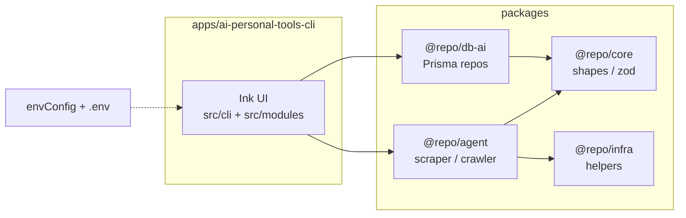

# Crafting Effective READMEs

## Overview

READMEs answer questions your audience will have. Different audiences need different information - a contributor to an OSS project needs different context than future-you opening a config folder.

**Always ask:** Who will read this, and what do they need to know?

## Process

### Step 1: Identify the Task

**Ask:** "What README task are you working on?"

| Task          | When                                   |
| ------------- | -------------------------------------- |
| **Creating**  | New project, no README yet             |
| **Adding**    | Need to document something new         |
| **Updating**  | Capabilities changed, content is stale |
| **Reviewing** | Checking if README is still accurate   |

### Step 2: Task-Specific Questions

**Creating initial README:**

1. What type of project? (see Project Types below)
2. What problem does this solve in one sentence?
3. What's the quickest path to "it works"?
4. Anything notable to highlight?

**Adding a section:**

1. What needs documenting?
2. Where should it go in the existing structure?
3. Who needs this info most?

**Updating existing content:**

1. What changed?
2. Read current README, identify stale sections
3. Propose specific edits

**Reviewing/refreshing:**

1. Read current README
2. Check against actual project state (package.json, main files, etc.)
3. Flag outdated sections
4. Update "Last reviewed" date if present

### Step 3: Always Ask

After drafting, ask: **"Anything else to highlight or include that I might have missed?"**

## Code style (README section)

For **Internal**, **Personal**, and contributor-facing READMEs, add a short **Code style** section when onboarding or consistency matters.

**How to author it (do not guess):**

1. Read the repo’s ESLint config (e.g. root `eslint.config.mts` or app-level config).
2. Summarize only rules that are enforced (warn/error), not preferences you assume.
3. If Prettier exists, merge its rules; if not, do not invent a Prettier profile.

**Suggested bullets:**

| Topic | What to document |
| ----- | ---------------- |
| Line length | `max-len` `code` value (and ignores for strings/comments if relevant) |
| Quotes | JS/TS string quotes vs JSX quotes (often different) |
| Indent | Spaces per indent (usually from `@stylistic/indent`) |
| Line endings | e.g. Unix (`LF`) if enforced |
| Imports | `consistent-type-imports`, path restrictions, barrel entrypoints |
| Naming | interfaces/types/classes if `naming-convention` is set |

### ai-personal-tools (reference)

This repo’s shared stylistic rules live in the root `eslint.config.mts` (`reactEslintConfig`). When documenting **this** workspace, you may copy or summarize:

- **Line length:** 100 columns (`@stylistic/max-len`), with `ignoreStrings` and `ignoreComments`.
- **Quotes:** single quotes for JS/TS strings; JSX attributes prefer **double** quotes (`@stylistic/jsx-quotes`).
- **Indent:** 2 spaces.
- **Line endings:** Unix (`LF`) — `@stylistic/linebreak-style`.
- **Trailing commas:** multiline — `@stylistic/comma-dangle` `always-multiline`.
- **Object spacing:** spaces inside `{ }` — `object-curly-spacing` `always`.
- **Arrow functions:** parens always — `arrow-parens` `always`.
- **TypeScript:** `type` over `interface` where the rule applies; `consistent-type-imports` with separate type imports; **no** `any`; imports must use public package entrypoints (e.g. `@repo/core/all`), not `packages/*/src/**`.

Re-read `eslint.config.mts` if rules change; this list can drift.

## Architecture (README section)

For **Internal** READMEs and apps with multiple layers, add an **Architecture** section. It should answer:

1. **Layout:** Role of each top-level folder (`apps/`, `packages/`, `shell/`, root config).
2. **Paradigm:** Mostly functional modules (plain functions, small factories) vs class-heavy OOP — infer from real code, don’t label “clean architecture” without evidence.
3. **In-repo relationships:** How the app’s folders map to features (e.g. `src/cli` vs `src/modules`).
4. **Monorepo packages:** Which workspace packages the project imports and why (one line each).

**Diagram:** Include a **Mermaid** diagram (renders on GitHub) showing:

- The app box
- Workspace packages it depends on
- Optional: data flow (e.g. CLI → agent → Firecrawl, CLI → db-ai → DB)

Keep the diagram high-level (5–10 nodes). Link to source paths for details.

### AI Personal Tools / ai-personal-tools monorepo (reference)

Use this as a template when writing architecture for **`ai-personal-tools-cli`** or the repo root README.

**Layout**

| Path | Role |
| ---- | ---- |
| `apps/ai-personal-tools-cli` | Bun + Ink + React terminal UI; routes and screens under `src/`. |
| `apps/.../src/cli` | Shared Ink layout and form UI components. |
| `apps/.../src/modules/*` | Feature modules (e.g. job extraction, video placeholder). |
| `packages/core` | Shared domain shapes and Zod-friendly types (`@repo/core/all`). |
| `packages/infra` | Cross-cutting helpers (e.g. Zod helpers, dates) (`@repo/infra/all`). |
| `packages/agent` | Firecrawl-based scraper/crawler tooling (`@repo/agent/all`). |
| `packages/db-ai` | Prisma data layer and repositories (`@repo/db-ai/all`). |
| `packages/tsconfig` | Shared TypeScript configs for apps/libs. |
| Root `envConfig.ts` / `shell/loadEnv.ts` | Validated env and upward `.env` discovery (`loadEnvFromRoot()`). |

**Paradigm**

- **TypeScript**, **ESM**, **React** (Ink) for the TUI.
- **Mostly functional:** services and controllers as functions or small factories (e.g. `jobPostingExtractService()`), not deep class hierarchies.
- **Boundaries:** UI (Ink) → controllers → services → `@repo/agent` / `@repo/db-ai`; shared validation and types in `@repo/core` / `@repo/infra`.

**Mermaid (example for docs)**

Adjust arrows if the documented app’s imports differ; verify with `package.json` and imports.

## Project Types

| Type            | Audience                      | Key Sections                             | Template                  |
| --------------- | ----------------------------- | ---------------------------------------- | ------------------------- |
| **Open Source** | Contributors, users worldwide | Install, Usage, Contributing, License    | `templates/oss.md`        |
| **Personal**    | Future you, portfolio viewers | What it does, Tech stack, Learnings      | `templates/personal.md`   |
| **Internal**    | Teammates, new hires          | Setup, Architecture, Code style, Runbooks | `templates/internal.md`   |
| **Config**      | Future you (confused)         | What's here, Why, How to extend, Gotchas | `templates/xdg-config.md` |

**Ask the user** if unclear. Don't assume OSS defaults for everything.

## Essential Sections (All Types)

Every README needs at minimum:

1. **Name** - Self-explanatory title
2. **Description** - What + why in 1-2 sentences
3. **Usage** - How to use it (examples help)

## References

- `section-checklist.md` - Which sections to include by project type
- `style-guide.md` - Common README mistakes and prose guidance
- `using-references.md` - Guide to deeper reference materials
