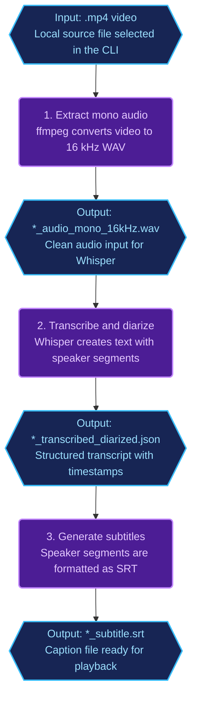

# ai-personal-tools

## Project description and objective

**AI Personal Tools** is a personal automation workspace for turning repetitive, high-context tasks into reliable AI-assisted workflows. Its immediate focus is on two practical pipelines: converting local videos into speaker-aware transcripts and subtitles, and extracting structured data from web pages.

This repository implements that vision as a **Bun workspaces** monorepo. Shared packages provide domain contracts (`@repo/core`), Firecrawl scraping and crawling wrappers (`@repo/agent`), MongoDB persistence through Prisma (`@repo/db-ai`), cross-cutting utilities (`@repo/infra`), and TypeScript presets (`@repo/tsconfig`). The main interactive surface today is `**ai-personal-tools-cli`**, an Ink + React terminal app composed on top of those packages.

Current product goals:

- **Video-to-text:** take a local `.mp4`, extract normalized audio, run Whisper transcription with diarization, and generate an `.srt` subtitle file.
- **Personalized web extraction:** scrape a single URL or crawl linked pages, validate AI-extracted structured data with Zod, and persist the result in MongoDB. Job postings are the current schema-backed use case, not the limit of the feature.

#### 1. Video-to-Text Pipeline

The video-to-text flow takes a local `.mp4` file and produces three artifacts: a normalized mono WAV file, a diarized JSON transcript, and an `.srt` subtitle file. The CLI validates the input path, runs `ffmpeg` to extract 16 kHz mono audio, calls `insanely-fast-whisper` with the configured Hugging Face token, then formats speaker segments into subtitles.

The supported conversion mode today is `Transcription, diarize and subtitles`. Summarization is intentionally not part of the active flow yet.

**Demo**

The demo below shows the terminal-driven flow: provide a video path, select the conversion type, watch the pipeline status, and review the generated output paths at the end.

[https://github.com/user-attachments/assets/0162dd44-23db-4196-bd7e-44e78f2805f0](https://github.com/user-attachments/assets/0162dd44-23db-4196-bd7e-44e78f2805f0)

**Video-to-Text Pipeline:**

Rounded rectangles denote **pipeline steps**; hexagons denote **artifacts** (inputs and outputs between steps).




#### 2. Personalized Web Scraper & Crawler (In Development)

The web extraction flow is the first slice of a personalized ingestion engine for arbitrary structured data on the web. From the CLI, the user chooses between extracting only the submitted page or crawling the page and its subpages. The service delegates single-page extraction to `scraper().execWithJsonAsync(...)` and multi-page extraction to `crawler().execJson(...)` from `@repo/agent`.

Firecrawl returns AI-extracted JSON, the app validates the result with a Zod schema, applies any schema-specific normalization, and persists valid records through the appropriate repository in `@repo/db-ai`. The current implemented schema targets job postings, but the feature objective is broader: collect any structured data from any web page through schema-driven extraction. Source-list management, scheduled runs, and broader personalized crawling are still planned work.

## Tech stack


| Area                      | Technology                                                                                        |
| ------------------------- | ------------------------------------------------------------------------------------------------- |
| Language                  | TypeScript (strict), ESM (`"type": "module"`)                                                     |
| Runtime / package manager | **Bun `1.3.2`** (pinned `engines.bun` and `packageManager`)                                       |
| Workspace layout          | Bun workspaces: `apps/*`, `packages/*`                                                            |
| Validation                | Zod 4                                                                                             |
| Terminal UI (app)         | React 19, Ink 6, `react-router` memory router                                                     |
| Scraping                  | Firecrawl SDK + `@repo/agent` (`scraper`, `crawler`)                                              |
| Database                  | MongoDB, Prisma 6, `prisma-zod-generator`                                                         |
| Lint / types              | ESLint (`--max-warnings 0`), `tsc --noEmit`                                                       |
| Env loading               | `shell/loadEnv.ts` → nearest `.env` walking up from `cwd`; root `envConfig.ts` validates with Zod |


Optional local tooling (CLI video module): `ffmpeg` and `insanely-fast-whisper` on `PATH` for transcription/diarization flows.

## Repository structure

```txt
ai-personal-tools/
├── apps/
│   └── ai-personal-tools-cli/          # Ink + React CLI — src/main.tsx; src/cli, src/modules/*, src/services/*
├── packages/
│   ├── core/                     # @repo/core — domain Zod contracts (JobPosting, enums)
│   ├── agent/                    # @repo/agent — Firecrawl scraper/crawler wrappers
│   ├── db-ai/                    # @repo/db-ai — Prisma, repos, migrations, generated Zod
│   ├── infra/                    # @repo/infra — terminal, fs, pollCrawl, zod helpers, branded results
│   └── ts/                       # @repo/tsconfig — shared tsconfig JSON presets (not "typescript" path)
├── shell/
│   └── loadEnv.ts                # find/load .env up from cwd (does not overwrite existing process.env)
├── envConfig.ts                  # root Zod schema for required env vars (import after loadEnv)
├── eslint.config.mts
├── package.json                  # workspaces root; name: ai-personal-tools
└── bun.lock
```

Generated artifacts (e.g. `packages/db-ai/generated/`) are produced by Prisma/Zod generators and are git-ignored — run `db-gen` after schema changes.

## Architecture overview

### Layering and dependency direction

Enforced direction (apps must not import Prisma or Firecrawl directly; use `@repo/db-ai` and `@repo/agent`):

```txt
apps/ai-personal-tools-cli
  → @repo/agent, @repo/db-ai, @repo/core, @repo/infra
packages/agent, packages/db-ai
  → @repo/core, @repo/infra (where applicable), @repo/tsconfig
@repo/infra
  → no imports from apps; no dependency on agent/db-ai (shared utilities leaf)
@repo/core
  → pure domain: see “@repo/core” below (runtime code: zod only; TS setup: @repo/tsconfig ok)
@repo/tsconfig
  → config-only JSON exports
```

**Apps vs packages:** nothing under `packages/`* may depend on or import from `apps/`*. Applications consume packages; packages never consume applications.

`**@repo/core`:** pure domain package — business entities, Zod-defined shapes, and application contracts shared across the monorepo. **Runtime imports in `packages/core/src` are limited to `zod` only** (no apps, no other runtime libraries, no imports from other workspace packages in domain code). `**@repo/tsconfig` is allowed** as a **devDependency** and only for **TypeScript setup** — for example `"extends": "@repo/tsconfig/..."` in `tsconfig.json`. It is not used for runtime behavior and must not be imported from domain modules for anything beyond compiler configuration.

### How packages communicate


| From                                             | To            | Role                                                                                                                         |
| ------------------------------------------------ | ------------- | ---------------------------------------------------------------------------------------------------------------------------- |
| `ai-personal-tools-cli` modules (`*.service.ts`) | `@repo/agent` | Single-page scrape (`scraper().execWithJsonAsync`) or multi-page crawl (`crawler().execJson`) with `outputSchema` + `prompt` |
| `ai-personal-tools-cli`                          | `@repo/core`  | Canonical job posting shape: `JobPostingSchema`, `JobPostingEntityT`, `WorkModel`, `EmploymentType`, `Seniority`             |
| `ai-personal-tools-cli`                          | `@repo/db-ai` | `jobPostingRepo().add(...)` and generated `tbZodSchema` when needed                                                          |
| `ai-personal-tools-cli`                          | `@repo/infra` | `zodHelper`, `strToDate`, terminal helpers, file utils, etc.                                                                 |
| `@repo/agent`                                    | `@repo/infra` | `pollCrawl`, file helpers for Firecrawl output; Firecrawl client is constructed in agent layer                               |
| `@repo/db-ai`                                    | `@repo/core`  | Persist `JobPostingEntityT`-aligned data; Prisma maps camelCase → snake_case in MongoDB                                      |


### End-to-end flow (web pages extraction)

```txt
Ink UI → controller (*.ctrl.ts) → service (*.service.ts)
  → @repo/agent (scrape/crawl + Zod parse)
  → @repo/core (domain contract alignment)
  → @repo/db-ai (jobPostingRepo → MongoDB)
```

### Package-by-package summary

- `**ai-personal-tools-cli` (`apps/ai-personal-tools-cli`)** — Routes and menus in `src/main.tsx`; feature folders under `src/modules/<feature>/` with `*.cli.tsx` → `*.ctrl.ts` → `*.service.ts`. Shared shell (layout, UI, hooks) under `src/cli/`. Media and text subprocess helpers under `src/services/` (e.g. audio/video/text pipelines for Video to Text). Uses `@repo/agent`, `@repo/db-ai`, `@repo/core`, `@repo/infra` only via public `@repo/*/all` entrypoints. See `apps/ai-personal-tools-cli/README.md` for the full tree.
- `**@repo/core` (`packages/core`)** — Pure domain layer: entities and contracts (Zod schemas and inferred types). **Runtime `dependencies` / imports in source: `zod` only.** `**@repo/tsconfig`** may appear as a **devDependency** for **TS config only** (`tsconfig.json` extends). No env vars. Changes here ripple to `@repo/db-ai` and any app that validates or displays job data.
- `**@repo/agent` (`packages/agent`)** — Wraps Firecrawl: `scraper()`, `crawler()`, shared client in `firecrawlTool`. Uses `@repo/infra` for polling and file I/O. `agent.ts` is stubbed; do not rely on it until wired.
- `**@repo/db-ai` (`packages/db-ai`)** — Prisma schema under `src/prisma/`, client init in `src/prisma.ts`, `jobPostingRepo` in `src/repo/`. Custom ordered migrations in `src/migrations/scripts/` registered in `src/migrations/run.ts`. `companyJobPages.json` supports job-search workflows.
- `**@repo/infra` (`packages/infra`)** — Utilities only: Clack adapter, subprocess streams, `pollCrawl` (caller passes Firecrawl client), `zodHelper`, `strToDate`, branded ok/err results. Not a place for app-specific business rules.
- `**@repo/tsconfig` (`packages/ts`)** — Exports JSON presets: `tsConfigBunHono`, `tsConfigReactApp`, `tsConfigReactLib` (see package `exports`). Consumed via `"extends": "@repo/tsconfig/..."` in package `tsconfig.json` files.

## Standards and conventions

- **Apps vs packages:** no package under `packages/*` may import from `apps/*`. Apps depend on packages, not the reverse.
- `**@repo/core` purity:** domain-only — entities and application contracts. **Only `zod`** in runtime `dependencies` / domain source imports. `**@repo/tsconfig**` is allowed **only for TypeScript setup** (e.g. `tsconfig.json` extends), not for runtime or domain logic.
- **Imports:** use public barrels only — `import { … } from '@repo/<pkg>/all'`. Do not import from `@repo/*/src/`** or `packages/*/src/`** (ESLint-enforced).
- **Functional style:** no `class` for domain/services; factory functions returning plain objects; Zod as single source of truth for shapes.
- **Naming:** camelCase for values; types as `PascalCase` + `T` suffix; React components `PascalCase`.
- **Code style:** 2-space indent; single quotes in TS; ~100 char lines; LF. After the import block in `.ts` files, the repo uses three blank lines before the first statement (local convention).
- **Post-change workflow:** in every touched package/app, run `bun run lint` and `bun run check-types` until both exit clean (`--max-warnings 0`). After `schema.prisma` changes: `db-gen` then lint/typecheck. Prefer fixing root causes over eslint/ts suppressions.
- **Barrels:** many packages expose `exports` / `exports-clean` (Barrelsby) to refresh `index.ts` when public API changes.

## Environment variables

Loaded by `loadEnvFromRoot()` then validated when `envConfig.ts` is imported (typically at app/process startup).


| Variable             | Required | Notes                                                                     |
| -------------------- | -------- | ------------------------------------------------------------------------- |
| `ENV`                | Yes      | `dev`                                                                     |
| `FIRE_CRAWL_API_KEY` | Yes      | Firecrawl API (`@repo/agent`)                                             |
| `AI_GATEWAY_API_KEY` | Yes      | Validated at root                                                         |
| `OPEN_ROUTER_KEY`    | Yes      | Validated at root                                                         |
| `DATABASE_URL`       | Yes      | MongoDB URL for Prisma                                                    |
| `HUGGING_FACE_TOKEN` | Yes      | e.g. Whisper/diarization CLI usage                                        |
| `WHISPER_MODEL_PATH` | Yes      | Default model path for video-to-text UI (length bounds in `envConfig.ts`) |


Example (placeholders):

```env
ENV=dev
FIRE_CRAWL_API_KEY=your_firecrawl_key
AI_GATEWAY_API_KEY=your_ai_gateway_key
OPEN_ROUTER_KEY=your_openrouter_key
DATABASE_URL=your_mongodb_url
HUGGING_FACE_TOKEN=your_hugging_face_token
WHISPER_MODEL_PATH=C:/ai/models/ggml-large-v3-turbo.bin
```

## Setup and run instructions

**Prerequisites:** Bun `1.3.2`, a root `.env` satisfying the table above, and a reachable MongoDB for `DATABASE_URL`. For DB work, run generators after cloning or schema changes.

From repository root:

```bash
bun install
```

Generate Prisma client and Zod artifacts (required before typecheck if `generated/` is missing):

```bash
bun run --filter @repo/db-ai db-gen
```

**Run the CLI** (from `apps/ai-personal-tools-cli`):

```bash
bun run dev
```

One-shot (no hot reload):

```bash
bun run terminal
```

Optional: push schema to DB (dev):

```bash
bun run --filter @repo/db-ai db-push
```

## Important scripts

### Root (`package.json`)


| Script                                | Purpose                                                                |
| ------------------------------------- | ---------------------------------------------------------------------- |
| `syncpack-fix` / `syncpack-list`      | Align/list workspace dependency version mismatches (syncpack)          |
| `exports-clean`                       | Runs `shell/packageJsonCommands.ts` for barrel cleanup across packages |
| `deps-circular` / `deps-circular-img` | Madge circular dependency analysis (optional SVG via `--image`)        |


### Per workspace package

Each of `@repo/core`, `@repo/agent`, `@repo/db-ai`, `@repo/infra`, `@repo/tsconfig`, and `ai-personal-tools-cli` defines:


| Script                      | Typical command                  | Purpose                                       |
| --------------------------- | -------------------------------- | --------------------------------------------- |
| `lint`                      | `bunx eslint . --max-warnings 0` | Lint                                          |
| `check-types`               | `bunx tsc --noEmit`              | Typecheck                                     |
| `exports` / `exports-clean` | Barrelsby                        | Regenerate barrel `index.ts` where configured |


`**@repo/db-ai` additionally:**


| Script       | Purpose                                                        |
| ------------ | -------------------------------------------------------------- |
| `db-gen`     | `prisma generate` — client + prisma-zod output                 |
| `db-push`    | `prisma db push` — dev schema sync                             |
| `db:migrate` | `bun src/migrations/run.ts` — ordered custom migration scripts |


Run from root with filters, e.g.:

```bash
bun run --filter @repo/core lint
bun run --filter ai-personal-tools-cli check-types
```

## Testing


| Location                                                  | Notes                                                                                                                                                                                                                    |
| --------------------------------------------------------- | ------------------------------------------------------------------------------------------------------------------------------------------------------------------------------------------------------------------------ |
| `ai-personal-tools-cli`                                   | `bun test` — e.g. `src/modules/webExtraction/jobPostingExtractionDef/webExtraction.schema.test.ts` (Zod/metadata alignment with `@repo/core`). No dedicated `test` script in `package.json`; invoke `bun test` directly. |
| `@repo/core`, `@repo/agent`, `@repo/infra`, `@repo/db-ai` | No package-level test scripts or test files found in documented layout; validate via `lint` + `check-types` and integration through the CLI.                                                                             |


## Usage examples

**Start the CLI** (see `apps/ai-personal-tools-cli/README.md` for keyboard shortcuts and flows such as Job Extraction and Video to Text):

```bash
cd apps/ai-personal-tools-cli
bun run dev
```

**Filter checks for one package:**

```bash
bun run --filter @repo/agent lint && bun run --filter @repo/agent check-types
```

**Persist a job posting (conceptual — from app or script using `@repo/db-ai`):**

```ts
import { jobPostingRepo } from '@repo/db-ai/all'

await jobPostingRepo().add({
  /* fields aligned with JobPostingEntityT from @repo/core */
})
```

**Scrape with JSON extraction:**

```ts
import { scraper } from '@repo/agent/all'
import z from 'zod'

const schema = z.object({ title: z.string() })

await scraper().execWithJsonAsync({
  url: 'https://example.com/job',
  outputSchema: schema,
  prompt: 'Return JSON matching the schema.',
  onStatusUpdate: (status, completed, total) => {
    /* … */
  },
})
```

## Contribution guidelines

- **CONTRIBUTING.md / PR template / branching policy:** Not found in the repository.
- **Expectation:** before opening a PR, run `lint` and `check-types` in every package you change; run `bun test` in `apps/ai-personal-tools-cli` when extraction or Zod contracts change. After Prisma schema edits, run `db-gen` and re-run checks.
- **Domain changes:** editing `@repo/core` job posting fields or enums requires coordinated updates in `@repo/db-ai`, CLI extraction prompts/schemas, and tests.

## License

No `LICENSE` file found at the repository root.