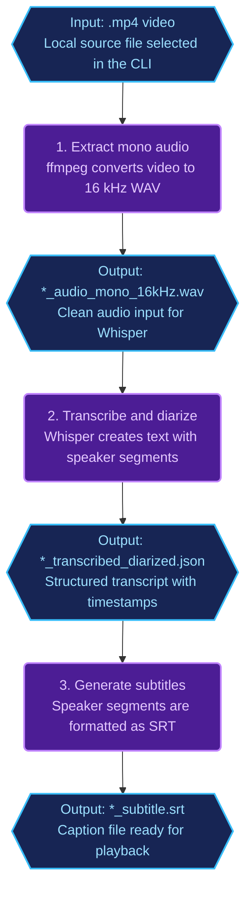

# Project name

`ai-personal-tools-cli`

## Project description and objective

`ai-personal-tools-cli` is an interactive terminal UI app in the **AI Personal Tools** (`ai-personal-tools`) monorepo. It serves as a powerful toolkit providing personalized, well-defined pipelines for data extraction and media processing. Initially designed to run entirely locally without relying on cloud infrastructure, the project focuses on high precision, low cost, and automation.

The CLI currently highlights two main features:

### 1. Video-to-Text Pipeline

This feature takes a video as input and generates **transcription, diarization, and captions** with high precision and low cost. It utilizes a Whisper model fine-tuned specifically for audio-to-text jobs and diarization.

**Demo**

Video: [https://www.youtube.com/watch?v=55JfRCa07Zw](https://www.youtube.com/watch?v=55JfRCa07Zw)

[](https://www.youtube.com/watch?v=55JfRCa07Zw)

**Video-to-Text Pipeline:**

Rounded rectangles denote **pipeline steps**; hexagons denote **artifacts** (inputs and outputs between steps).




### 2. Personalized Web Scraper & Crawler (In Development)

Currently in active development, this feature acts as an automated ingestion engine. It allows users to manage a list of source URLs and set up cron jobs to run scraping and crawling across all saved sources. Powered by the **FireCrawl** service, the pipeline extracts content, maps it into structured data (validated via Zod), and saves the results into a **MongoDB** database.

## Tech stack

- **Language:** TypeScript (ESM)
- **Runtime / package manager:** Bun `1.3.2`
- **UI:** React `19` + Ink `6` (`ink-select-input`, `ink-text-input`, `ink-spinner`)
- **Routing:** `react-router` (memory router in terminal)
- **Extraction / crawling:** Firecrawl SDK + shared wrappers in `@repo/agent`
- **Validation:** Zod
- **Persistence:** Prisma (`@repo/db-ai`, `DATABASE_URL`)
- **Monorepo:** Bun workspaces (`apps/`*, `packages/`*)
- **Lint / types:** ESLint + TypeScript (`tsc --noEmit`)
- **Video module (local tooling):** `ffmpeg` and `insanely-fast-whisper` must be available on `PATH` for `transcribeDiarize`; orchestration lives in `videoToText.service.ts` with `src/services/audioProcess/`, `src/services/videoProcess/`, and `src/services/textProcess/` (see `*.service.ts` / `*.script.ts` there for subprocess and formatting steps)

## Repository structure

Monorepo context (sibling packages) plus **this app’s** `src/` layout:

```txt
ai-personal-tools/
├── apps/
│   └── ai-personal-tools-cli/                 # This app — Ink + React terminal UI
│       ├── package.json
│       ├── tsconfig.json
│       ├── skills-lock.json
│       └── src/
│           ├── main.tsx                 # MemoryRouter, routes, menu
│           ├── cli/
│           │   ├── index.cli.tsx       # Root shell composition
│           │   ├── components/
│           │   │   ├── layout/         # layout.cli.tsx, header, footer
│           │   │   └── ui/             # selectField, textField, table, cliStatus, etc.
│           │   ├── hooks/              # cliStatus, useInputReady, useTerminalSize
│           │   └── providers/          # (reserved; may be empty)
│           ├── modules/
│           │   ├── jobPostingExtract/
│           │   │   ├── jobPostingExtract.cli.tsx
│           │   │   ├── jobPostingExtract.ctrl.ts
│           │   │   ├── jobPostingExtract.service.ts
│           │   │   └── jobPostingExtractDef/   # prompt, schema, desc, tests
│           │   └── videoToText/
│           │       ├── videoToText.cli.tsx
│           │       ├── videoToText.ctrl.ts
│           │       └── videoToText.service.ts
│           ├── services/               # Shared media/text pipelines (used by videoToText)
│           │   ├── audioProcess/       # audioProcess.service.ts, audioProcess.script.ts
│           │   ├── videoProcess/       # videoProcess.service.ts, videoProcess.script.ts
│           │   └── textProcess/        # textProcess.service.ts
│           └── shared/                 # lib/, utils/ (placeholders; may be empty)
├── packages/agent/
├── packages/core/                      # @repo/core — JobPostingSchema, enums (see packages/core/README.md)
├── packages/db-ai/
├── packages/infra/
└── packages/ts/
```

Local dev may also create `.logs/` (e.g. ffmpeg logs); that directory is not part of the source layout.

## Architecture overview

Flow for the implemented extraction path:

`Ink UI` -> `controller` -> `service` -> `@repo/agent` (scrape/crawl) -> `@repo/core` schema -> `@repo/db-ai` repository -> database

`@repo/core` is the canonical job-posting contract: public entrypoint `@repo/core/all` re-exports `JobPostingSchema`, `JobPostingShape`, `JobPostingEntityT`, and enums `WorkModel`, `EmploymentType`, `Seniority` (defined in `packages/core/src/domain/jobPosting.entity.ts`). Same shapes are referenced by `@repo/db-ai` and this app.

Key boundaries observed in code:

- `src/cli` handles terminal rendering and focus/navigation state, shared layout/UI, and hooks.
- `src/modules/*/*.cli.tsx` collects user input and handles UI status.
- `*.ctrl.ts` routes flow decisions (e.g., page-only vs subpages).
- `*.service.ts` in modules performs extraction, persistence, or module-level orchestration; heavy subprocess work for video/audio often lives under `src/services/`.
- Shared packages expose public entrypoints (`@repo/*/all`).

Known implementation risks:

- `videoToText`: `videoToTextCtrl().transcribeDiarize` runs ffmpeg → `insanely-fast-whisper` → formatting in `videoToText.service.ts` (requires external CLIs on `PATH`; optional envs such as `WHISPER_MODEL_PATH` for UI defaults — see `envConfig` / `videoToText.cli.tsx`).
- The extraction prompt requests a `job_openings` wrapper and `application_url`, while runtime parsing expects a single job object and `applicationUrl`. This can cause extraction/runtime contract mismatch.

## Standards and conventions

- **TypeScript:** strict mode enabled; no emit in app checks.
- **Imports:** ESLint forbids importing from package internals like `@repo/*/src/`**; use public exports (`@repo/*/all`).
- **Formatting/lint style:** 2-space indentation, single quotes, multiline argument parentheses rules, max line length warnings.
- **Architecture convention:** UI/components → module controllers → module services → shared packages (`@repo/agent`, `@repo/db-ai`, `@repo/core`, `@repo/infra`); subprocess-heavy media/text work may live under `src/services/` and be called from module services.
- **Validation-first extraction:** extraction output is parsed by Zod before persistence.

## Environment variables

Loaded from the nearest `.env` found by walking up from `cwd` (`loadEnvFromRoot()` in `shell/loadEnv.ts`).


| Variable             | Required | Used by                       | Notes                                                                                 |
| -------------------- | -------- | ----------------------------- | ------------------------------------------------------------------------------------- |
| `ENV`                | Yes      | `envConfig.ts`                | Allowed: `dev`, `hml`, `prod`                                                         |
| `FIRE_CRAWL_API_KEY` | Yes      | `@repo/agent` scraper/crawler | Firecrawl API auth                                                                    |
| `AI_GATEWAY_API_KEY` | Yes      | `envConfig.ts`                | Workspace env schema                                                                  |
| `OPEN_ROUTER_KEY`    | Yes      | `envConfig.ts`                | Workspace env schema                                                                  |
| `DATABASE_URL`       | Yes      | Prisma / `@repo/db-ai`        | MongoDB connection                                                                    |
| `HUGGING_FACE_TOKEN` | Yes      | `videoToText.service.ts`      | Passed to `insanely-fast-whisper` (diarization)                                       |
| `WHISPER_MODEL_PATH` | Yes      | `videoToText.cli.tsx`         | Default Whisper model path shown in UI (must satisfy schema length in `envConfig.ts`) |


Example `.env` (placeholders — align with root `envConfig.ts`):

```env
ENV=dev
FIRE_CRAWL_API_KEY=your_firecrawl_key
AI_GATEWAY_API_KEY=your_ai_gateway_key
OPEN_ROUTER_KEY=your_openrouter_key
DATABASE_URL=your_database_url
HUGGING_FACE_TOKEN=your_hugging_face_token
WHISPER_MODEL_PATH=C:/ai/models/ggml-large-v3-turbo.bin
```

## Setup and run instructions

Prerequisites:

- Bun `1.3.2`
- A valid root `.env` with required keys
- Reachable database for `DATABASE_URL`

Install dependencies from repository root:

```bash
bun install
```

Run from `apps/ai-personal-tools-cli`:

```bash
bun run dev
```

Run once (no hot reload):

```bash
bun run terminal
```

## Important scripts

From `apps/ai-personal-tools-cli/package.json`:


| Script          | Command                                                                   | Purpose                         |
| --------------- | ------------------------------------------------------------------------- | ------------------------------- |
| `dev`           | `cd ../.. && bun run --hot apps/ai-personal-tools-cli/src/main.tsx`       | Run CLI with hot reload         |
| `terminal`      | `cd ../.. && bun run apps/ai-personal-tools-cli/src/main.tsx`             | Run CLI once                    |
| `lint`          | `bunx eslint . --max-warnings 0`                                          | Lint app source                 |
| `check-types`   | `bunx tsc --noEmit`                                                       | Type checking                   |
| `exports`       | `barrelsby --delete --singleQuotes --noSemicolon --c barrels.config.json` | Generate barrel exports         |
| `exports-clean` | PowerShell remove old `index.ts` + barrelsby                              | Regenerate clean barrel exports |


## Testing

- **Current tests found:** `src/modules/jobPostingExtract/jobPostingExtractDef/jobPostingExtract.schema.test.ts`
- **Scope:** Zod field descriptions and payload shape validation for the job extraction module (keep fields aligned with `@repo/core/all` — `JobPostingSchema`, `WorkModel`, `EmploymentType`, `Seniority`; see `packages/core/README.md`)
- **Command from app directory:** `bun test`
- **Dedicated `test` script in `package.json`:** Not found

## Usage examples

Start the app:

```bash
cd apps/ai-personal-tools-cli
bun run dev
```

Keyboard navigation:

- `↑` / `↓`: switch menu route
- `→`: move focus to screen content
- `←`: move focus back to menu
- `q` or `Ctrl+C`: quit

Job extraction flow:

1. Select `Job_Extraction`
2. Choose `Extract only a page` or `Extract page and subpages`
3. Enter the job URL
4. Confirm with `y`
5. Wait for progress updates and saved job IDs

Video to text flow:

1. Select `Video to Text`
2. Enter the path to a local video file
3. Choose a conversion type (e.g. transcription + diarize)
4. Confirm when prompted; wait for ffmpeg / Whisper steps to finish

## Contribution guidelines

- `CONTRIBUTING` file: Not found
- Branching strategy: Not found
- PR template: Not found
- Local validation expectation (Assumption: medium confidence): run `bun run lint`, `bun run check-types`, and `bun test` in `apps/ai-personal-tools-cli` before submitting changes

## License

License file: Not found